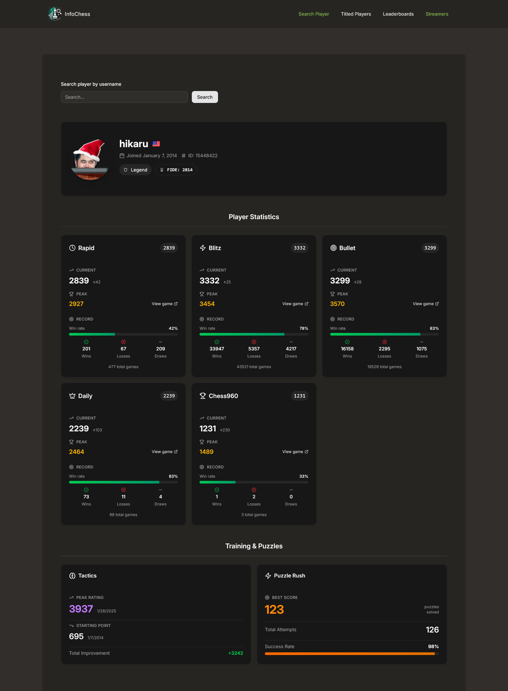
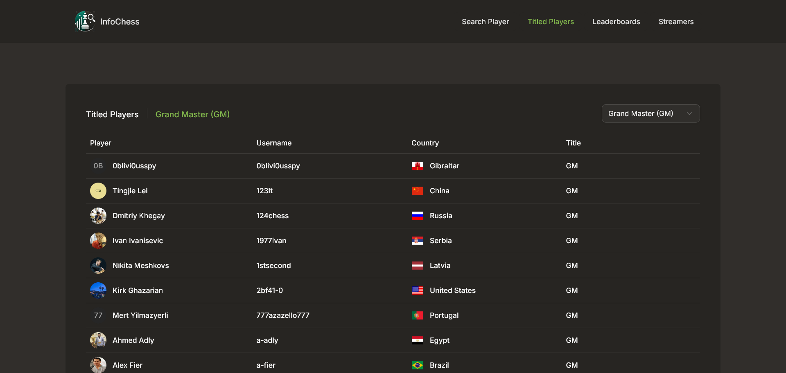
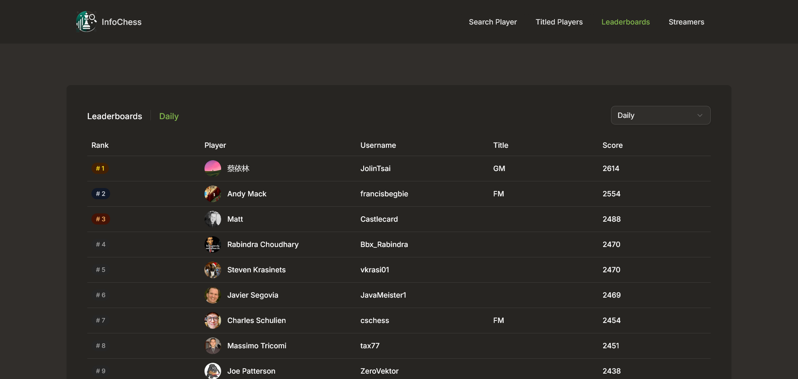
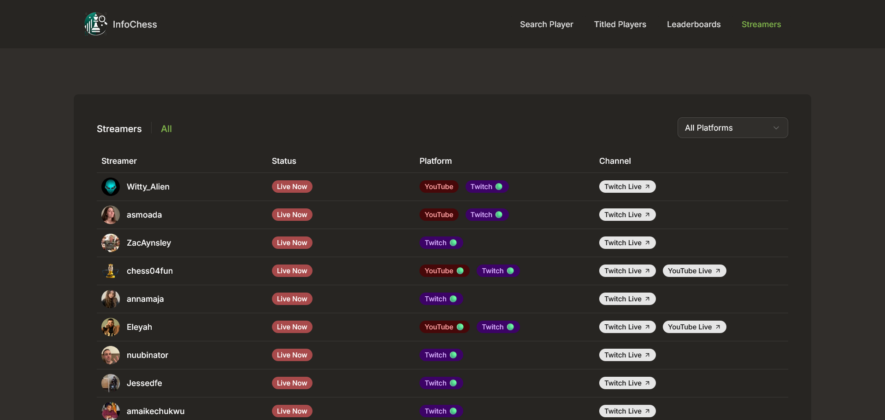

<div align="center">
  
  
</div>

<p>InfoChess is a web application that allows users to search and retrieve detailed information about Chess.com players. It fetches real-time player data such as ratings, statistics, match history, and account details through the Chess.com public API, providing an easy and user-friendly way to analyze player performance.</p>

## Table of contents

- [Features](#features)
- [Live preview](#-live-preview)
- [Tech stack](#-tech-stack)
- [Screenshots](#-screenshots)
- [Installation](#-installation)
- [Developer](#-developer)
- [Contributing](#-contributing)

## 👾 Features

- Search Player
- View Player Statistics
- View Titled Players
  - View by different categories
- View Leaderboards
  - View by different categories
- View Streamers
  - View by different platforms

## 🚀 Live Preview

Visit the application: <a href="https://infochess.netlify.app/" target="_blank">https://infochess.netlify.app/</a>

## 💻 Tech Stack

📜 **Frontend**

[](#)
[](#)
[](#)
[](#)
[](#)
[](#)
[](#)

## ♟️ API

All data comes from `Chess.com` API - [https://www.chess.com/news/view/published-data-api](https://www.chess.com/news/view/published-data-api)

## 📷 Screenshots

  
  
  
  

## ⚙️ Installation

Follow the steps below to set up the project locally:

1.  **Fork the repository**  
    Click the **Fork** button at the top-right corner of this page to copy the repository to your GitHub account.

2.  **Clone the repository**

    ```bash
    git clone https://github.com/quielScript/infochess.git
    ```

3.  **Open the project in your code editor/IDE**

    You can achieve this by simply opening the project folder directly in your code editor/IDE.

4.  **Install dependencies**

    After you open the project, simply run the command below in the terminal to install the dependencies.

```bash
  npm i
```

5. **Start development environment**:

   After installing the dependencies, execute the command below in the terminal to start the development environment.

```bash
npm run dev
```

## 🧑‍💻 Developer

<table>
  <tbody>
    <tr>
      <td align="center" valign="top">
        
        <br />
        <b>Exequiel Arco</b>
      </td>
    </tr>
    <tr>
        <td align="center">
            <a href="https://github.com/quielScript" target="_blank">
            
            </a>
            <br/>
            <a href="https://www.linkedin.com/in/exequielarco" target="_blank">
            
            </a>
        </td>
    </tr>
  </tbody>
</table>

## 🌟 Contributing

Contributions are welcome!
